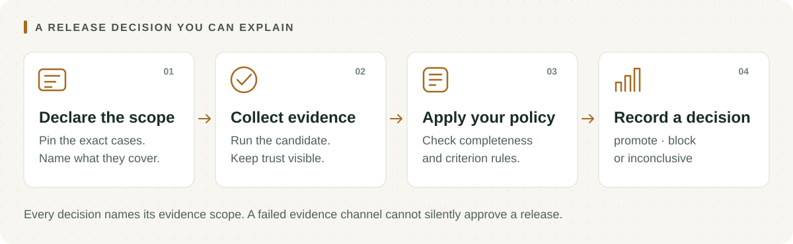

<h1 align="center">Dailies</h1>

<p align="center"><strong>Review the evidence before the release.</strong></p>

<p align="center">
  <a href="https://github.com/luka-zivkovic/dailies/actions/workflows/ci.yml"></a>
  <a href="https://www.npmjs.com/package/dailies"></a>
  <a href="LICENSE"></a>
</p>

<p align="center">
  <a href="#quickstart">Quickstart</a> · <a href="#how-it-works">How it works</a> · <a href="#cli-reference">CLI</a> · <a href="#run-in-github-actions">GitHub Actions</a> · <a href="#minimal-configuration">Configuration</a> · <a href="#evidence-integrations">Evidence</a> · <a href="#decision-safety">Decisions</a>
</p>

Dailies helps you decide whether an AI change is ready to advance. It runs
your candidate against declared cases, collects evaluation evidence, and
applies your release policy. The report keeps evidence scope, trust, and
missing results visible.

<p align="center">
  <picture>
    <source media="(max-width: 600px)" srcset="docs/assets/workflow-mobile.svg">
    
  </picture>
</p>

## Install with your coding agent

In Claude Code, add the marketplace and install the plugin:

```text
/plugin marketplace add luka-zivkovic/dailies
/plugin install dailies@dailies
```

The `release-gate` skill then walks the agent through `dailies init`, the
three evidence trust classes, the run, and reading the report and exit codes
as `promote`, `block`, or `inconclusive`.

For Codex or another agent, paste one line: `Read
https://raw.githubusercontent.com/luka-zivkovic/dailies/main/plugins/dailies/skills/release-gate/SKILL.md
and follow it to set up and run a Dailies release gate in this project.`

## How it works

| Decision | Meaning |
| --- | --- |
| `promote` | The candidate satisfied the declared policy on the declared evidence scope. |
| `block` | Complete, admissible evidence shows that the candidate violates policy. |
| `inconclusive` | Required evidence is missing, failed, or cannot be verified. |

A failed evidence channel produces `inconclusive`. Missing evidence stays
visible, with the exact precedence documented under [Decision safety](#decision-safety).

Dailies runs locally and does not sit on the serving path. It contacts only the
candidate, judge, or Rubrist endpoints that you explicitly configure.

## Quickstart

Requires Node.js 20 or newer.

```sh
npm install --save-dev dailies
npx dailies init
npx dailies --config dailies.config.json
```

`dailies init [directory]` creates `dailies.cases.jsonl` and a valid,
digest-pinned `dailies.config.json`. It will never overwrite either file. The
starter runs three demonstration cases through a deterministic exact-match
evaluator and writes its reports to `dailies-out/`:

```text
decision: promote | pass rate 100.0% (3/3), regressions 0, evaluated 3/3, errored 0
report: .../dailies-out/report.json
report: .../dailies-out/report.md
```

The generated scope deliberately claims only those three demonstration
behaviors. Replace the cases, scope description, and candidate command with
your real release evidence before using the decision in CI. Whenever the JSONL
bytes change, the configured SHA-256 digest and `scope.expectedItems` must
change with them. `dailies digest` recomputes both from the exact file bytes
and rewrites only those two keys in place:

```sh
npx dailies digest --config dailies.config.json          # update the config
npx dailies digest --config dailies.config.json --check  # verify only; exit 1 on drift
```

The command prints the old and new values. `--check` never writes and is
meant for a CI step that catches an edited corpus before the release run
stops with `input artifact digest mismatch`.

To run the repository's five-case example instead:

```sh
git clone https://github.com/luka-zivkovic/dailies.git
cd dailies
npm ci
npm run build
node dist/cli.js --config fixtures/dailies.config.json
```

Runnable v5 (evaluator suite) and v6 (calibration-aware) examples live under
[`fixtures/examples/`](fixtures/examples/README.md). Their manifests and
calibration artifacts are verified offline, but receipt evidence always
comes from a Rubrist HTTP endpoint, so they ship with a local stub that
returns scripted, structurally valid receipts:

```sh
node scripts/mock-rubrist.mjs --manifest fixtures/examples/v5-suite/suite-manifest.json &
node dist/cli.js --config fixtures/examples/v5-suite/dailies.config.json
node dist/cli.js --config fixtures/examples/v6-calibration/dailies.config.json
```

A `promote` from these examples demonstrates the report format only; the
stub is not an evaluator.

The command exits with:

| Code | Decision | CI meaning |
| ---: | --- | --- |
| `0` | `promote` | Policy satisfied. |
| `1` | `block` | Candidate should not advance. |
| `2` | `inconclusive` | The run or required evidence failed. |

## CLI reference

| Command | Purpose | Exit codes |
| --- | --- | --- |
| `dailies --config <path>` | Run the release evaluation and write `report.json` and `report.md`. | `0` promote, `1` block, `2` inconclusive or run error |
| `dailies init [directory]` | Create a runnable, digest-pinned schema-v4 starter without overwriting existing files. | `0` created, `2` refused or failed |
| `dailies digest --config <path>` | Recompute the JSONL input digest and line count and update `inputs.digest` and `scope.expectedItems` in place (schema v4, v5, and v6). | `0` updated or already current, `2` error |
| `dailies digest --config <path> --check` | Report whether the config matches the input artifact without writing. | `0` match, `1` mismatch, `2` error |

Paths inside a config resolve relative to the config file. `dailies digest`
changes only the two identity keys and preserves the file's key order and
formatting; it never edits thresholds, policy, or scope descriptions.

## Run in GitHub Actions

The repository root ships a composite action, so a release gate needs no
hand-written shell. The action runs `npx --yes dailies@<version> --config
<config>`, appends `report.md` to the job summary, and maps the exit code:
`block` fails the job, and `inconclusive` fails the job by default. Setting
`fail-on-inconclusive: false` turns it into a `::warning::` line while the
`decision` output still says `inconclusive`; it is never mapped to success
silently. Node.js 20 or newer must already be on the runner.

```yaml
name: release-gate
on: [pull_request]

jobs:
  gate:
    runs-on: ubuntu-latest
    steps:
      - uses: actions/checkout@v4
      - uses: actions/setup-node@v4
        with:
          node-version: 20
      - name: Verify the corpus digest before running
        run: npx --yes dailies@0.3.0 digest --config dailies.config.json --check
      - id: dailies
        uses: luka-zivkovic/dailies@main
        with:
          config: dailies.config.json
          # version: 0.3.0                # dailies npm version (default: the action's release)
          # fail-on-inconclusive: 'true'  # 'false' warns instead of failing
          # summary: 'true'               # append report.md to the job summary
      - if: always()
        run: echo "decision=${{ steps.dailies.outputs.decision }} exit=${{ steps.dailies.outputs.exit-code }}"
```

| Input | Default | Meaning |
| --- | --- | --- |
| `config` | required | Path to the Dailies configuration, relative to the workspace. |
| `version` | current release | `dailies` npm version passed to `npx`. |
| `fail-on-inconclusive` | `true` | Fail the step on exit code `2`; `false` emits a warning instead. |
| `summary` | `true` | Append `report.md` to `$GITHUB_STEP_SUMMARY`. |

Outputs: `decision` (`promote`, `block`, or `inconclusive`), `exit-code`, and
the absolute `report-json` and `report-md` paths (empty when no report was
written). Pin the action to a tag or commit rather than `@main` for
reproducible gates. The step logic lives in
[`scripts/action-run.sh`](scripts/action-run.sh) and is covered by the test
suite.

## Why Dailies

Ordinary tests can tell you whether code runs. They cannot tell you whether an
AI change regressed a known behavior, whether a judge result is trustworthy,
or whether the evidence actually covers the population you intend to release
to.

Dailies makes those assumptions explicit:

- **Scope-bound decisions** — every claim names the exact dataset or sample it covers.
- **Honest incompleteness** — infrastructure and protocol failures become `inconclusive`, not synthetic passes or failures.
- **Visible evidence trust** — deterministic, verified, and self-reported results stay distinct.
- **Customer-owned policy** — Dailies applies your thresholds and criterion roles; an evaluator does not decide whether you ship.
- **Reproducible reports** — exact input identity, operations, policy, evidence, and decision precedence remain auditable.

## Minimal configuration

This schema-v4 example evaluates one criterion over an exact, digest-pinned
JSONL regression corpus:

```json
{
  "schemaVersion": 4,
  "inputs": {
    "type": "jsonl",
    "path": "cases.jsonl",
    "digest": "sha256:<digest-of-the-exact-file-bytes>"
  },
  "scope": {
    "id": "checkout-regressions-v1",
    "kind": "regression_corpus",
    "expectedItems": 24,
    "collectionProcedure": "Curated failures from reviewed support escalations.",
    "population": "Known checkout-assistant failure modes.",
    "timeWindow": {
      "kind": "not_applicable",
      "reason": "This is a static regression corpus."
    }
  },
  "candidate": {
    "type": "http",
    "url": "http://localhost:8080/generate",
    "bodyTemplate": "{\"prompt\": {input}}"
  },
  "judge": { "type": "exact-match" },
  "thresholds": {
    "minPassRate": 1,
    "maxRegressions": 0
  },
  "output": { "dir": "./dailies-out" }
}
```

Each JSONL row has a stable ID and input. `baseline_label` is optional, but it
is required for a paired comparison; `baseline_output` supplies evaluator
context and never silently implies that the baseline passed.

```json
{"id":"checkout-001","input":"Where is my order?","baseline_label":"pass","baseline_output":"Your order is in transit."}
```

See the [bundled configuration](fixtures/dailies.config.json) and
[configuration reference](docs/report-v4.md) for the complete contract.

## Evidence integrations

| Integration | Trust class | Intended use |
| --- | --- | --- |
| Built-in exact match | `deterministic` | Reproducible baseline comparisons without an external judge. |
| Verified Rubrist receipt | `verified` | Governed evaluator evidence with pinned identity, coverage, and digests. |
| Generic HTTP judge | `self_reported` | Migration and custom integrations without a verifiable evidence envelope. |

Verified and deterministic evidence are admissible by default. A generic HTTP
judge cannot independently promote a release unless the customer policy
records an explicit self-reported-evidence override and reason. The override
admits the evidence; it does not upgrade its trust class.

## Bring your own eval platform

If you already run Promptfoo, DeepEval, or Braintrust, Dailies can gate on
those results today only through the generic HTTP judge: a small service you
own calls your platform for each item and returns its pass/fail. That evidence
is `self_reported`, so it needs the explicit override described above.

Native result-file adapters are **proposed, not implemented**.
[ADR-0006](docs/decisions/0006-third-party-eval-result-intake.md) records the
open questions. Imported results would stay `self_reported`, even if Dailies
ran the platform itself and pinned the output file's digest. A file digest
proves which bytes Dailies read. It does not verify the platform's results.

## Configuration generations

Dailies keeps earlier report formats readable while adding new capability
through explicit schema versions:

- **v4 — single criterion:** one declared scope with exact-match, HTTP, or Rubrist evidence.
- **v5 — evaluator suite:** a pinned, policy-free Rubrist suite with separate evidence and policy for each criterion.
- **v6 — calibration-aware suite:** exact local calibration artifacts, evaluated per trial without silently pooling variance.

The detailed contracts live in [report v4](docs/report-v4.md),
[report v5](docs/report-v5.md), and [report v6](docs/report-v6.md), and
each generation has a runnable example: [v4](fixtures/dailies.config.json),
[v5](fixtures/examples/v5-suite/), and [v6](fixtures/examples/v6-calibration/).

## Decision safety

Release decisions follow a fixed precedence:

1. A required evidence-channel integrity failure is `inconclusive`.
2. A candidate-attributable execution failure is `block`.
3. Complete, admissible blocking evidence is `block`, even if unrelated mandatory evidence is missing.
4. Missing mandatory evidence with no known block is `inconclusive`.
5. Complete and admissible evidence is evaluated normally under customer policy.

This behavior is defined in
[ADR-0005](docs/decisions/0005-decision-precedence.md) and covered by the
authored invariant suite. The suite is a correctness gate, not a competitor
benchmark or a product-superiority claim.

## Data and security

- Candidate commands run on the machine invoking Dailies.
- Candidate, judge, and Rubrist HTTP requests go only to configured endpoints.
- Authentication header **names**, but not their values, may appear in execution identity records.
- Reports contain evaluation inputs, candidate outputs, labels, and reasons. Treat report artifacts as potentially sensitive data.
- Dailies is not an inference proxy and does not require production traffic to pass through it.

Please report vulnerabilities using the process in [SECURITY.md](SECURITY.md).

## Product boundaries

Dailies owns the release consequence. It does not author rubrics, establish
human truth, or statically inspect capability packages.

- [Rubrist](https://github.com/luka-zivkovic/rubrist) produces governed, policy-free assessment evidence.
- [Casefile](https://github.com/luka-zivkovic/casefile) produces deterministic trust evidence for capability artifacts.
- Dailies currently verifies Rubrist evidence and applies customer-owned release policy. Casefile consumption remains a possible future integration.

The products share explicit evidence contracts; they do not collapse into one
runtime.

## Documentation

- [Product charter](PRODUCT.md) — authoritative target scope
- [Architecture decisions](docs/decisions/README.md) — accepted product and evidence semantics
- [Shared glossary](docs/glossary.md) — precise portfolio terminology
- [Implementation plan](PLAN.md) — current sequencing and demand-gated work
- [Evidence contracts](contracts/README.md) — vendored schemas and conformance fixtures
- [Changelog](CHANGELOG.md) — notable changes by release
- [Contributing guide](CONTRIBUTING.md) — local checks and pull request expectations

`PRODUCT.md` and accepted ADRs define target behavior. The README describes
the current CLI and does not override those sources.

## Development

```sh
npm ci
npm run build
npm test
npm run invariant:batch6
npm pack --dry-run
```

The test suite covers onboarding, configuration, execution, retries, evidence
verification, policy, reporting, tamper cases, and deterministic fault
injection; `npm test` reports the current test count. GitHub Actions runs the
build, the complete test suite, and the invariant robustness gate on Node.js 20
and 22 for every push and pull request.

See [CONTRIBUTING.md](CONTRIBUTING.md) for the local checks and review
expectations before opening a change.

Dailies is pre-1.0 software. Schema compatibility is deliberate, but the
public CLI and library API may still evolve before a stable release.

## License

[MIT](LICENSE) © 2026 Luka Živković
